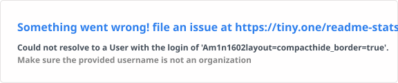

# Hi, I'm Aman Gautam 👋

### C++ Developer • ML/AI Enthusiast • IIT (BHU)

I like building things and understanding how they work under the hood — from **C++ game systems and simulations** to **financial data pipelines, machine learning, and RAG-based applications**.

* 🎓 Student at **IIT (BHU), Varanasi**
* 💻 Strongest in **C++ and Python**
* 🎮 Interested in **game development, graphics, physics, and systems programming**
* 🤖 Exploring **machine learning, deep learning, and LLM applications**
* 📊 Currently building software around **financial data and analysis**

---

## 🛠️ Tech Stack

### Languages


### Development


### Game Development


### Data / ML / AI


**AI / Finance:** `RAG` · `LLM Applications` · `XBRL` · `Financial Analysis` · `Vector Search`

---

## 🚀 Featured Projects

### 📈 [Fin_QA](https://github.com/Am1n1602/Fin_QA)

**Python • RAG • LLM • Financial Analysis**

A financial question-answering system focused on Indian equities.

* Deterministic financial ratio engine for company analysis
* RAG pipeline for answering questions using financial information
* Supports **NSE/BSE companies**
* Exposed through **CLI, API, and dashboard**
* Combines structured financial computation with LLM-based reasoning

> Building toward a broader financial intelligence platform for fundamental analysis, financial QA, and automated research.

---

### 🎮 [Just-Another-World-Godot](https://github.com/Am1n1602/Just-Another-World-Godot)

**Godot • GDScript • Game Development**

A game-development project exploring the **Godot engine** and modern 2D game workflows.

* Experimenting with gameplay systems and scene architecture
* Working with Godot's node-based design
* Exploring a development workflow beyond my C++ / Raylib projects

---

### 🕹️ [Just-another-easy-game](https://github.com/Am1n1602/Just-another-easy-game)

**C++ • Raylib • Node.js • MongoDB**

A 2D platformer built from scratch using Raylib.

* Built in **C++ without a traditional game engine**
* Includes player movement, physics, traps, level design and gameplay systems
* Published as a playable browser game
* Includes an online leaderboard backed by a Node.js server and MongoDB

🎮 **[Play the game](https://peepow.itch.io/just-another-easy-game)**

---

### ⚛️ [ParticleCollision](https://github.com/Am1n1602/ParticleCollision)

**C++ • Raylib • Physics Simulation**

A real-time particle collision simulation built to explore **physics programming and interactive simulation**.

* Particle interaction and collision handling
* Real-time visualization with Raylib
* Focused on understanding simulation and game-physics fundamentals

---

## 🔨 Currently Exploring

```text
Financial Data      → XBRL → JSON → Analysis → Financial QA
AI / LLM            → RAG → Retrieval → Grounded Answers
Machine Learning    → ML → Deep Learning → Applied AI
Game Development    → Physics → Graphics → Engine Architecture
Systems Programming → C++ → Performance → Low-level Concepts
```

---

## 💡 What I Enjoy Building

**Systems & Software Engineering**
Backend systems, APIs, performance-oriented C++, and understanding software at a lower level.

**Game Development**
Graphics, physics, movement systems, simulations, and game-engine architecture.

**AI & Data**
Machine learning, financial data analysis, RAG systems, and practical LLM applications.

---

## 📊 GitHub

[](https://github.com/Am1n1602)

<p align="center">
  
</p>

---

## 🤝 Connect

[](https://www.linkedin.com/in/am1n-gautam/)
[](https://x.com/Am1n1602)
[](https://peepow.itch.io/just-another-easy-game)

📧 **[amangautam1602@gmail.com](mailto:amangautam1602@gmail.com)**

---

<p align="center">
  <i>Build. Break. Learn. Repeat.</i>
</p>
